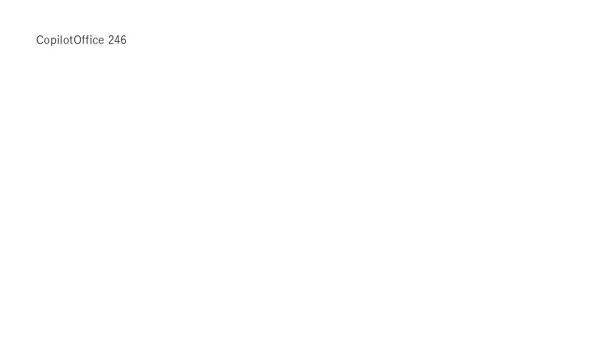

# 実Copilot生成：Excel・Word・PowerPoint

2026-09-07、実M365 CopilotへPADからコピーした16操作と生成ガイドを渡し、採取例とは異なる本文 `CopilotOffice 246`、異なる3つの保存名を指定しました。

- [prompt.txt](prompt.txt)：実際に渡した合成データのプロンプト。最終改訂前の生成ガイドと採取原文を含む凍結記録です。
- [generated.robin](generated.robin)：生成原文。コードは手直ししていません。
- [pasted.robin](pasted.robin)：PADへの貼付け後に再コピーした原文。
- [review.json](review.json)：16命令を採取例と照合し、依頼された本文と保存名以外の変更がないことを確認した記録。
- [verification.json](verification.json)：生成・貼付け・実行結果と検証範囲。

専用フロー `test` の空サブフロー `OfficeCopilot` へ貼り付け、最初のアクションから1回実行しました。新規作成したブックのA1、Word本文、PowerPointの1枚のスライドに指定文言が保存されました。[生成物の内容・ハッシュ](../../evidence/office/copilot-artifacts.json)を確認し、PowerPointは再度ネイティブアプリで開いて画像出力・目視確認しています。

PADが改行と末尾改行を正規化したため、生成原文と再コピーのSHA256は異なります。改行表現を揃えた命令行は完全一致です。元の2ファイルは加工せず保存しています。

最初の生成試行は画面読取り失敗で送信前に停止しました。所有済みタブの `has_sent=false` と送信試行記録がないことを確認し、準備完了後に別の試行として成功しました。

これはCopilot生成→助手による照合→PAD貼付け・実行の1ケースです。アプリの自動Run検証器へOffice操作を追加したものではなく、任意のOffice操作・文書・書式に対する汎用性の保証でもありません。
