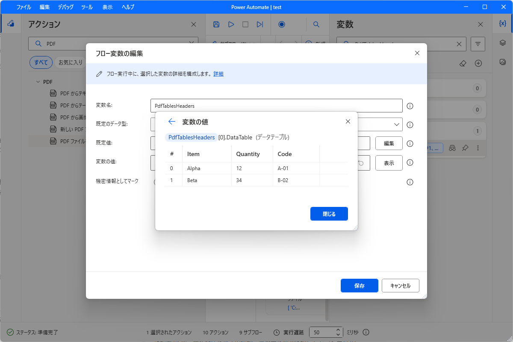

# PDFアクションの採取記録

2026-09-07、PAD 2.71.115.26224、日本語UIの左欄「PDF」に表示された5種類から11設定例を採取し、[生成プロンプト](../pad-robin-prompts.md)へ収録しました。専用フロー `test` を使用しています。Power Fxのスイッチ自体はこのフローで個別に再確認していません。コピーした通常Robinの再貼付け・実行結果として記録します。

|アクション|設定例|実機で確認した内容|
|---|---|---|
|PDF からテキストを抽出|全ページ、2～3ページ、2ページのみ、2ページ＋構造化データに最適化（4例）|対象ページの識別文字、日本語、100%を保持。全ページ・範囲ではページ境界が区切りなしでつながる箇所あり|
|PDF からテーブルを抽出する|先頭行を列名にする／しない（2例）|列名ありは2行3列、なしは見出しを含む3行3列。セルの内容を照合|
|PDF から画像を抽出|全ページ／1ページ（2例）|どちらも160×80の埋め込み画像1個。全ピクセルが合成元画像と一致|
|新しい PDF ファイルへの PDF ファイル ページの抽出|2～3ページ、上書きしない（1例）|2ページを指定順に出力。元ページとの描画一致|
|PDF ファイルを統合|A→Bの入力／B→Aの入力、上書きしない（2例）|いずれも5ページを出力。ただし入力リストと逆順になった|

## 統合時の順序に関する実測

|コピー原文のPDFFiles|生成PDFのページ順|
|---|---|
|source-a.pdf、source-b.pdf|B1、B2、A1、A2、A3|
|source-b.pdf、source-a.pdf|A1、A2、A3、B1、B2|

最初の検証ではA→Bを期待していたため、順序検査が失敗しました。期待値に合わせて原文を書き換えず、PADの設定をB→Aへ変更した2つ目の原文を別例として採取し、再試験しました。両方とも2ファイルのインラインリスト入力です。

これはこの版・この入力での実測です。3ファイル以上、変数リスト、別のPAD版への一般化はしていません。プロンプトには順序を仮定せず、依頼された順序と実際のページ内容を照合するルールを追加しました。今回、PAD自体を修正したわけではありません。

## 変数と抽出内容

テキスト出力では `Synthetic data onlyPDF Catalog...` のように前ページの末尾と次ページの先頭がつながりました。文字列全体を整形して隠すことはせず、[原文の実行値](../catalog/evidence/pdf/text-all.json)を保存しています。ページ単位の対応が必要な依頼には単一ページの設定例を使い、結果とページ番号を別々に管理します。

テーブル抽出結果はPDFテーブル情報オブジェクトのリストです。先頭要素の `.DataTable` が表で、`.TableStartingPage`、`.TableEndingPage`、`.TableOrderInPage` も変数ビューアーから確認しました。今回の表は開始・終了ページ2、ページ内順序1です。リストをそのままデータテーブルと扱わないようプロンプトに記載しました。

画像抽出では `CatalogImage_0.png` を生成しました。末尾の0はPDFページ番号ではありません。PDFの全ページを画像化する操作やOCRとしても扱っていません。

## 証拠と範囲

- [索引](../catalog/index.json)：11例のUI名、設定、コピー原文のSHA256、実行範囲。
- [合成入力](../catalog/fixtures/pdf/README.md)：Aが3ページ、Bが2ページ。元の業務資料は使用していません。
- [10操作の組合せ](../catalog/flows/pdf-variants/assembled.robin)：結果を区別するためテキスト4・表2の出力変数名だけを変更。再コピーはバイト一致し、`PdfVariants` の先頭から1回実行。
- [統合順の追加例](../catalog/flows/pdf-merge-order/roundtrip.robin)：`PdfCatalog` の最後の統合アクションだけを実行し、空の `PdfMergeOrder` への再貼付けもバイト一致。
- [検証結果](../catalog/evidence/pdf/results.json)：テキスト・表・画像・ページ順の照合、抽出2ページ＋統合2ケース各5ページの計12ページの描画ピクセル一致、入力2ファイルのハッシュ不変。

`PdfCatalog` は途中の設定例を編集しながら採取したフローです。`catalog/flows/pdf-catalog/default.robin` は逆順入力の再試験より前の5操作スナップショットで、この5操作全体をそのまま実行した記録ではありません。

`MultiPageTables: True` の設定値は採取しましたが、複数ページにまたがる表の精度は未検証です。既存出力との衝突、暗号化・スキャンPDF、フォーム・署名、任意PDFでの抽出精度も未検証です。PDFコマンドのCopilot再生成とアプリの自動Runへの接続は今回の確認に含みません。既存の契約試験では、このPDFフローをアプリが実行前に拒否することを確認しています。

## アプリ接続の追記（2026-09-08）

上記の採取時点の「自動Run未接続／未検証」は、その後の実装で更新しました。Office/PDFの採取形式を検証器・出力観測・完了判定へ接続し、Office3ファイル作成とPDF各操作の2ケースをアプリ開始からDONEまで確認しました。PDF表は追加採取したCSV書出しで保存します。現在のカタログは34種類・51設定です。

検証範囲・制約・先行失敗・未完了事項は [自動Run接続チェックポイント](document-run-checkpoint-2026-09-08.md) を参照してください。既存Office文書の自動Run、書式・レイアウト、別PC・社内受入は未確認です。
